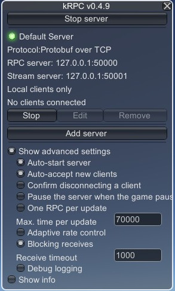

# ksp_bridge

ROS2 package for Kerbal Space Program based on the kRPC mod.

## Installation

The installation of the [kRPC mod](https://github.com/nullprofile/krpc) and it's dependencies.

### Libraries

Installation of the protobuf library:

```bash
sudo apt update
sudo apt install -y libprotobuf-dev
```

Installation of the ASIO standalone library:

```bash
wget https://sourceforge.net/projects/asio/files/asio/1.22.1%20%28Stable%29/asio-1.22.1.tar.bz2
tar xf asio-1.22.1.tar.bz2
cd asio-1.22.1
./configure
make
sudo make install
```

### kRPC - Kerbal Space Program

```bash
mkdir krpc; cd krpc
wget https://github.com/nullprofile/krpc/releases/download/0.4.9-1.12.1/krpc-0.4.9-1.12.1.zip
unzip krpc-0.4.9-1.12.1.zip
```

Copy the *GameData/kRPC* directory into the *GameData* directory of Kerbal Space Program.
The path can be obtained through Steam (Right Click->Manage->Browse local files).

### kRPC - C++ library

```bash
cd krpc/client
unzip krpc-cpp-0.4.9.zip
cd krpc-cpp-0.4.9
mkdir build; cd build
cmake ..
make
sudo make install
sudo ldconfig
```

## Compilation

Assuming the ROS2 workspace is *~/ros2_ws*.

```bash
cd ~/ros2_ws/src
git clone https://github.com/g0mb4/ksp_bridge.git
cd ..
colcon build
source ~/.bashrc
```

## Server settings



**Note**: *Max. time per update* is required to be high, but it affects the framerate.

## Usage

See examples.
