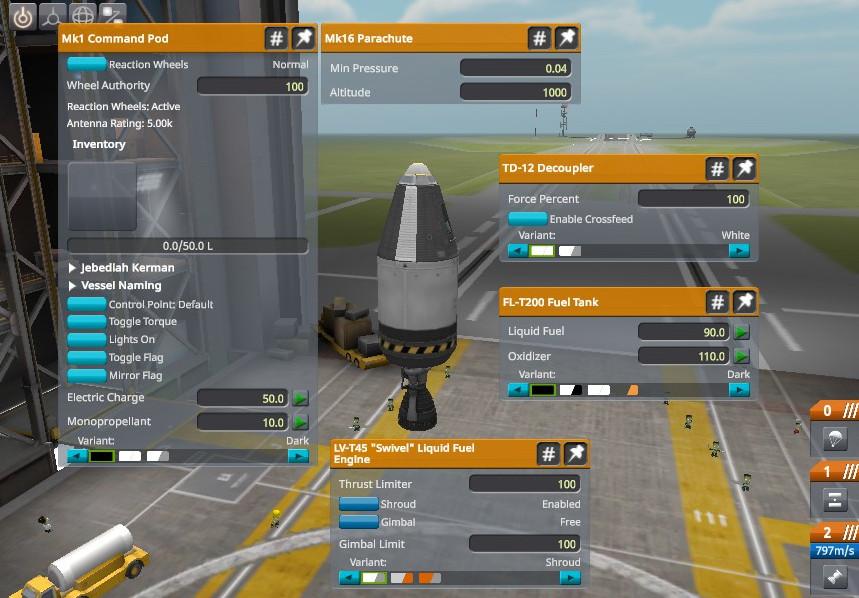

# Kerbal Space Program Bridge Examples

Example usage of the *ksp_bridge* package.

## Up and down

The ship goes up then falls down.

### Assembly



### Usage

```bash
ros2 launch ksp_bridge_examples up_and_down.launch.py
```
